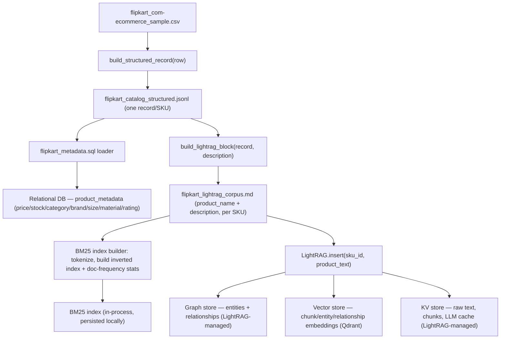
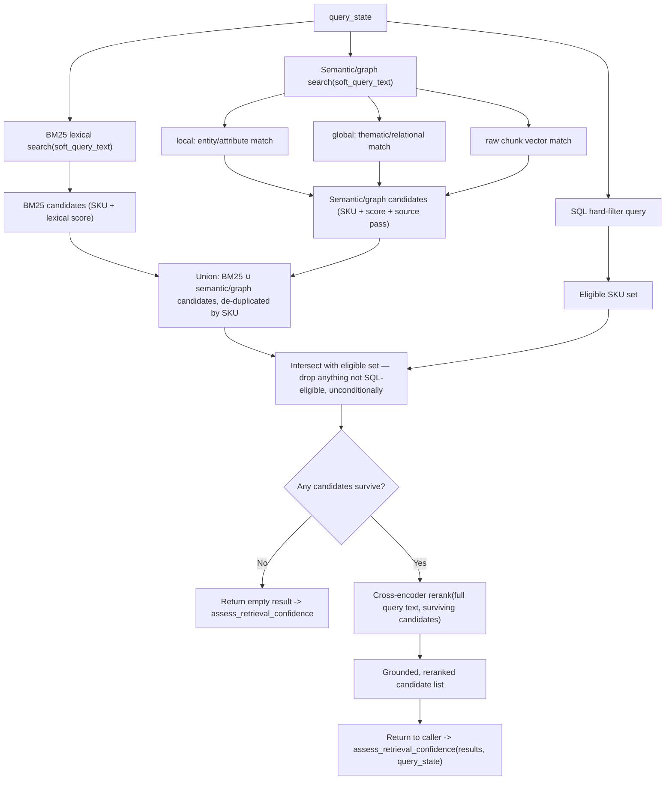

# Retrieval Architecture — `search_catalog` Internals

## Status

**Decided and partially built:**

1. **Tier 3 (Qdrant + LightRAG) is the target** for the semantic/graph branch.
   That part of `CLAUDE.md`'s stack line still needs formal revision before
   Qdrant/LightRAG code lands (see **Open decisions**). Tier 1/2 stay inside
   today's approved stack and are the fallback if Qdrant/LightRAG don't fit
   the build calendar.
2. **The relational store is built.** `flipkart_to_lightrag.py` already
   produces `flipkart_catalog_structured.jsonl` (one structured record per
   SKU) and `flipkart_metadata.sql` (the `CREATE TABLE product_metadata` +
   `INSERT` statements loaded straight from that JSONL). This is no longer a
   future "relational loader" — it exists, is populated, and is the
   authoritative source for every hard-filterable and displayable fact.
3. **The text corpus is description-only, by design, and already built.**
   `flipkart_lightrag_corpus.md` (built by `build_lightrag_block` in
   `flipkart_to_lightrag.py`) contains, per SKU, only: a `# Product:` heading
   (name, for readability), a `Product ID:` line (the join key back to SQL),
   and a `## Description` section — the raw cleaned `description` field.
   Brand, category, material, price, stock, rating are deliberately **not**
   duplicated into this corpus; they already live in `product_metadata` and
   are fetched from there, never guessed from free text. This decision now
   generalizes to every retrieval branch that reads unstructured text — see
   "One text corpus, two search engines" below.
4. **BM25 lexical retrieval is added** as a third retrieval branch alongside
   SQL hard-filtering and semantic/graph search — see "Component overview —
   online query" and "The three retrieval branches" below. This closes a real
   gap: dense/graph retrieval is good at *meaning* ("something for a wedding")
   but can smooth over or miss exact tokens (a model number, an exact brand
   spelling, a specific fabric word) that a shopper actually typed. BM25 costs
   nothing extra infrastructure-wise — it's a pure in-process scoring
   function over the same corpus already being built — so it's in scope at
   every tier, not gated behind the Qdrant/LightRAG decision.

## Scope boundary

This document changes **one tool's internals only**: `search_catalog(query_state)`,
step 7 of `architecture.md`'s step-by-step execution table. Nothing else in
that document changes — not the chat loop, `resolve_intent_and_delta`, the
confidence gate, recovery, reference resolution, cart tools, session state, or
terminal states. `search_catalog`'s external contract (input: `query_state`,
output: ranked eligible candidates) stays exactly as already defined in
`architecture.md`'s tool contract table. Everything below is what happens
*inside* that one box.

## Data foundations: what's already built

Three files already exist and are the ground truth this whole document
builds on:

| File | Role | Built by |
|---|---|---|
| `flipkart_catalog_structured.jsonl` | One structured JSON record per SKU (`sku_id`, `product_name`, `brand`, `category`, `category_is_fallback`, `subcategory_path`, `material`, `size`, `retail_price`, `discounted_price`, `rating`, `stock_status`, `stock_quantity`, `stock_is_synthetic`, `specifications`) | `build_structured_record` in `flipkart_to_lightrag.py` |
| `flipkart_metadata.sql` | `CREATE TABLE product_metadata (...)` + one `INSERT` per SKU, loaded 1:1 from the JSONL's scalar fields | generated from the JSONL |
| `flipkart_lightrag_corpus.md` | One `# Product / Product ID / ## Description` block per SKU — description text only | `build_lightrag_block` in `flipkart_to_lightrag.py` |

`product_metadata`'s actual columns (from `flipkart_metadata.sql`):

```sql
CREATE TABLE IF NOT EXISTS product_metadata (
    sku_id                VARCHAR(64) PRIMARY KEY,
    product_name          VARCHAR(512),
    brand                 VARCHAR(255),
    category              VARCHAR(255),
    category_is_fallback  TINYINT(1),
    subcategory_path      VARCHAR(512),
    material              VARCHAR(255),
    size                  VARCHAR(100),
    retail_price          DECIMAL(10, 2),
    discounted_price      DECIMAL(10, 2),
    rating                DECIMAL(3, 2),
    stock_status          ENUM('in_stock', 'low_stock', 'out_of_stock'),
    stock_quantity        INT,
    quantity              INT
);
```

This is the single source of truth for every **hard constraint**
(`price cap`, `size`, `category`, `stock`) and every **displayable fact**
(`brand`, `rating`, `subcategory_path`). Retrieval never re-derives these
from free text and never lets the semantic/lexical branches answer a question
this table can answer deterministically.

### One text corpus, two search engines

The description-only decision isn't just about LightRAG — it's the general
rule for *all* unstructured-text retrieval in this pipeline:

> Structured, checkable facts live in `product_metadata` and are read from
> there. The text corpus (`flipkart_lightrag_corpus.md`'s per-SKU
> `product_name + description`) exists only for the things structured fields
> *can't* answer — loose phrasing, use-case language, sentiment-free
> descriptive text ("gentle machine wash," "pull-out mechanism," "ideal for
> monsoon") that a shopper might reference in natural language but that was
> never worth promoting to a column.

Both new text-search branches — BM25 (lexical) and LightRAG (semantic/graph)
— read the *same* corpus, not two different ones. That matters: if BM25
indexed a different blob than LightRAG (e.g. one includes brand/category text
and the other doesn't), the two branches would silently disagree about what
"matching" means for the same SKU, and a shopper's exact-keyword query could
rank differently than intuition suggests. One corpus, two scoring mechanisms,
one merge step — see below.

## Component overview — offline ingestion



Three stores come out of ingestion now, feeding three retrieval branches at
query time — relational (SQL), lexical (BM25), and semantic/graph (LightRAG)
— but only **two roles**: structured facts (one store) and unstructured text
(one corpus, indexed two different ways). Nothing about the JSONL/SQL/corpus
generation changes what's already built; BM25 indexing is a new, purely
additive step over the corpus that already exists.

## The three retrieval branches, explained

### 1. SQL hard filter — deterministic eligibility

Runs a `WHERE` query against `product_metadata` on `query_state`'s hard
constraints: price cap (`discounted_price <= X`), `stock_status != 'out_of_stock'`,
`category`, `size`. This produces the **eligible SKU set** — the one and only
gate nothing else in the pipeline is allowed to bypass. Every candidate from
every other branch gets intersected against this set before reranking; a
candidate not in it is dropped unconditionally, regardless of how well it
scored semantically or lexically.

### 2. BM25 lexical search — exact-term retrieval

**What it is.** BM25 is a classic sparse lexical scoring function (an
improved TF-IDF): for a query's tokens, it scores each document by how often
those exact tokens appear, discounted by how common the token is across the
whole corpus and normalized for document length. No embeddings, no LLM call,
no external service — just token statistics computed once at ingestion time.

**Why it's in the pipeline at all**, given LightRAG already does semantic
retrieval: dense/graph retrieval is built to catch *meaning* — "something
formal for a wedding" pulling in a product whose description never says
"wedding" but is clearly formalwear. That strength is also its failure mode
for **exact tokens**: a specific fabric word ("Lycra"), a model/style code
("ALTHT_3P_21"), or an exact spelling a shopper typed verbatim can get
smoothed over by embedding similarity or dropped entirely if LightRAG's
extraction step didn't judge it "entity-worthy." BM25 has no such judgment
step — if the token is in the text, it scores it. It's the same reasoning
already used in this doc for why LightRAG's `mix` mode includes a raw
chunk vector pass alongside `local`/`global` — this is a second, even more
literal fallback specifically for exact-token recall, and it's cheap enough
to run unconditionally rather than only as a last resort.

**Ingestion.** At corpus-build time, tokenize each SKU's `product_name +
description` text (lowercase, strip punctuation, simple whitespace split —
no stemming needed at this catalog size) and build an inverted index plus
per-token document frequencies. At 500–1,000 products this is a small
in-memory structure; use a lightweight pure-Python library (`rank_bm25`'s
`BM25Okapi` is the obvious fit — one small dependency, no service, no model
weights) and persist the built index locally (pickle) so it doesn't
rebuild on every process start, the same pattern as Chroma's local
persistence.

**Query time.**

```python
scores = bm25_index.get_scores(tokenize(soft_query_text))
top_bm25_candidates = top_n(scores, n=50)  # SKU IDs + BM25 score
```

`soft_query_text` is the exact same soft/semantic query text handed to
LightRAG (see below) — never the hard-constraint fields, which stay SQL-only.
This keeps the two branches directly comparable: same query text, same
corpus, different scoring mechanism.

**Why this doesn't need the Qdrant/LightRAG sign-off.** `rank_bm25` is a pure
Python, in-process library — no new service, no new model, no infra
provisioning. It can and should ship in Tier 1, before any Qdrant/LightRAG
decision lands.

### 3. Semantic/graph search — LightRAG (Tier 3) or Chroma (Tier 1/2)

Unchanged from the design already agreed: `rag.query(soft_query_text,
param=QueryParam(mode="mix", only_need_context=True))` runs three passes —
`local` (entity/attribute match), `global` (relational/thematic match), and a
raw chunk vector pass — against the same description-only corpus. See
"LightRAG — what it is, and exactly what we give it" below for the full
detail (kept from the prior version of this doc, unchanged).

## Candidate fusion & rerank

Three branches produce three differently-shaped outputs — a strict eligible
set (SQL), a lexically-scored candidate list (BM25), and a
semantically/graph-scored candidate list (LightRAG/Chroma) — and they need to
become one ranked list.



**Union, not intersection, between BM25 and semantic/graph.** A SKU only
needs to be found by *one* of the two text-search branches to be considered —
requiring both would throw away exactly the cases each branch exists to catch
alone (an exact token BM25 finds that embeddings miss, or a thematic match
LightRAG finds that shares no literal tokens with the query). The **only**
mandatory intersection is against the SQL eligible set, because that's the
one guarantee that can never be relaxed.

**Why no weighted score fusion (e.g. Reciprocal Rank Fusion) before rerank.**
At this catalog size (500–1,000 SKUs), the union of both branches' top-N is
still small enough to rerank in full with a cross-encoder, so there's no need
to pre-trim with a fusion formula before reranking — the cross-encoder is a
strictly more accurate relevance signal than either branch's own score, so it
should see every surviving candidate rather than a fusion-trimmed subset.
**If the catalog grows large enough that full reranking becomes too slow**,
Reciprocal Rank Fusion (`score = Σ 1/(k + rank_in_branch)`) is the documented
fallback to pre-trim the union down to a top-K before reranking — flagged
here as a known lever, not built now.

**What survives to the cross-encoder is scored against the full original
query text** (not just `soft_query_text`), so the final ranking also reflects
whatever the hard-constraint phrasing implied about intent (e.g. "formal"
showing up in both the category filter and the description ranking).

## Step-by-step (inside `search_catalog`)

| Step | Component | What happens | Guardrail |
|---:|---|---|---|
| 1 | Hard-filter query | SQL query on `product_metadata` for price cap, stock, category, size against `query_state`'s hard constraints | The only mandatory intersection in the pipeline — never relaxed by anything downstream |
| 2 | BM25 lexical search | Score every SKU's `product_name + description` tokens against `soft_query_text`; take top-N | Read-only against the prebuilt index; catches exact tokens semantic search can miss |
| 3 | Semantic/graph retrieval (`mode="mix"`) | Three passes over the same corpus: entity-level match, relational/thematic match, raw chunk vector match | Read-only against the graph/vector store; never writes, never mutates catalog |
| 4 | Candidate union | Merges BM25's and step 3's candidates, de-duplicated by `sku_id` | A SKU needs to be found by only one branch to proceed |
| 5 | Eligibility intersection | Intersects the union with step 1's eligible set | Anything not hard-filter-eligible is dropped here, unconditionally |
| 6 | Cross-encoder rerank | Reranks the merged, already-eligible candidates against the full query text | Only reorders; cannot introduce an ineligible SKU |
| 7 | Return | Passes ranked, grounded candidates back to `search_catalog`'s caller | Output shape identical to today's `search_catalog` contract |

## LightRAG — what it is, and exactly what we give it

**What it is.** LightRAG (HKUDS) is a retrieval library, not just an
algorithm — you `insert()` documents, it does extraction and indexing
internally, and you `query()` it later. It is not something we write our own
entity-extraction pipeline for; extraction is LightRAG's own job, done inside
`insert()`.

**What we give it at ingestion — one call per product:**

```
rag.insert(product_text, ids=sku_id)
```

`product_text` here is the same description-only text as the corpus file —
`product_name + description`, per SKU. No brand/category/material/price get
folded in; those already live in `product_metadata` (see "One text corpus,
two search engines" above). Internally, LightRAG:

1. Chunks the text (for a short product record this is usually one chunk).
2. Runs its own configured LLM (point this at Gemini 2.5 Flash — the
   project's existing model — via LightRAG's pluggable `llm_model_func`) to
   pull out entities and relationships from that chunk.
3. Writes the results across **four storage roles** it expects you to
   configure, not one:
   - **KV storage** — raw docs, chunks, LLM response cache (default: local
     JSON files — fine as-is, no new dependency).
   - **Vector storage** — embeddings for chunks, entities, and relationships.
     This is the role Qdrant fills — set `vector_storage="QdrantVectorDBStorage"`
     and point it at a Qdrant instance instead of LightRAG's default
     (`NanoVectorDBStorage`).
   - **Graph storage** — the actual entity/relationship graph (default:
     in-memory NetworkX — fine for 500–1000 products, no need for Neo4j at
     this scale).
   - **Doc status storage** — tracks what's been ingested, for
     incremental re-ingestion without a full rebuild.

**Constraining what it extracts.** By default LightRAG's entity extraction
is generic (person, organization, location, event...). Point it at our
schema instead via its `addon_params={"entity_types": [...]}` config, passing
exactly the `entity_type` values in the schema table below — otherwise it
will happily extract irrelevant entity types out of product descriptions.

**What we give it at query time:**

```
rag.query(soft_query_text, param=QueryParam(mode="mix", only_need_context=True))
```

- `soft_query_text` is the *soft/semantic* part of the current turn only —
  "cotton, formal, wedding" — never the hard filters (price cap, size,
  stock). Hard filters are the relational DB's job (step 1 above), never
  LightRAG's or BM25's.
- `mode="mix"` runs three retrieval passes together, not two: `local`
  (entity-level matches, e.g. "cotton"), `global` (relationship/thematic
  matches, e.g. "wedding outfit," "similar brand"), and a direct vector
  search over the raw product-text chunks (the same mechanism as `naive`
  mode). The first two are what `hybrid` mode alone would give; `mix` adds
  the third. That third pass matters specifically for the hallucination-rate
  bar — graph retrieval only surfaces what the LLM extraction step decided
  was an entity/relationship, so an exact spec (a size, a price, a material
  word) can get smoothed over during extraction. Raw chunk vector search is
  a second, more literal path back to the exact catalog text — and BM25 (see
  above) is a third, even more literal one still, for cases where even
  vector similarity on the raw chunk doesn't surface an exact token.
- `only_need_context=True` is the detail that matters most for this
  pipeline: by default LightRAG's `query()` also calls an LLM to generate a
  prose answer from the retrieved context. We don't want that — response
  generation belongs to the outer chat workflow's response writer, not to
  `search_catalog`. This flag makes LightRAG return the retrieved
  chunks/entities/relationships (with their source SKU references) instead
  of generated text, which is what the candidate merger and reranker
  actually need to operate on.

## Entity/relationship schema (what we configure LightRAG to extract)

This isn't a schema we build ourselves — it's the `entity_types` list we pass
into LightRAG's `addon_params` so its extraction step stays inside what a
shopping query actually needs, instead of its generic default (person,
organization, location, event...).

| Field | Purpose | Example |
|---|---|---|
| `entity_type` | Node types passed to `addon_params={"entity_types": [...]}` | `PRODUCT`, `BRAND`, `CATEGORY`, `MATERIAL`, `OCCASION`, `STYLE` |
| `relationship_type` | Edge labels LightRAG's extraction LLM assigns between entities | `SAME_BRAND_AS`, `SIMILAR_TO`, `PART_OF_OUTFIT`, `COMPATIBLE_WITH`, `MADE_OF`, `SUITABLE_FOR_OCCASION` |
| `source_sku_id` / `target_id` | What the edge connects, carried via the `ids=sku_id` passed to `insert()` | product SKU to another SKU, brand, material, or occasion node |
| `confidence` | LightRAG's own extraction confidence, read back at query time | drop low-confidence edges before they reach the candidate merger, same discipline as the lexicon mapping's `confidence` field elsewhere in this project |

This is deliberately narrow. The graph only needs to answer relational
queries the SQL/BM25/vector layers can't — "what pairs with this," "similar
brands," "typical for this occasion." It is not a general knowledge graph and
should not accumulate entity types beyond what a shopping query actually
needs.

## Why three branches, not one

| Branch | Catches | Misses |
|---|---|---|
| SQL hard filter | Exact structured facts (price, stock, category, size) | Anything not modeled as a column — all free-text intent |
| BM25 lexical | Exact tokens verbatim in the text — brand spellings, model codes, specific fabric/feature words | Paraphrase, synonyms, "meaning" without shared tokens ("formal" when the text only says "office wear") |
| Semantic/graph (LightRAG) | Meaning and relations without shared tokens; thematic/occasion matches; cross-product relationships | Can smooth over or drop an exact token during extraction/embedding; more expensive, slower, and only as good as the extraction LLM's judgment |

No single branch covers a real shopper query end to end. A query like "cotton
formal shirt under ₹1500, size M, similar to what I'd wear to a wedding" needs
all three at once: SQL for `price <= 1500` and `size = M`, BM25 for the exact
word "cotton," and semantic/graph for "similar to what I'd wear to a wedding"
matching a description that never uses those words. This is also why the
merge step unions BM25 and semantic/graph rather than requiring both to agree
— each is allowed to catch what the other misses, and the SQL intersection is
the only place either can be *overridden*.

## What does *not* change

- `search_catalog`'s external signature and output shape — unchanged.
- `assess_retrieval_confidence` — reads the same result shape it always has;
  it does not know or care whether candidates came from one branch or three.
- The confidence-gated recovery loop, reference resolution, cart tools,
  session state, terminal states — none of this document touches them.

## Tiered scope

BM25 is **tier-independent** — it's a cheap, in-process addition that doesn't
touch the Qdrant/LightRAG decision, so it ships in Tier 1 and stays unchanged
through Tier 3. Only the semantic/graph branch moves between tiers.

**Tier 1 (buildable now, no stack change):** SQL hard filters + BM25 lexical
search + Chroma dense vector search, unioned and intersected with the
eligible set, simple score combination (no cross-encoder rerank yet, no
graph). This is what `search_catalog` already is per the current phase plan.
Ship this first.

**Tier 2 (buildable now, no stack change):** Add a cross-encoder reranker on
top of Tier 1's merged candidates. A BGE reranker model can run locally like
`sentence-transformers` does — no new *service* dependency, just a second
local model. BM25 branch unchanged; still no graph, no Qdrant.

**Tier 3 (target — Qdrant + LightRAG):** Replace the plain Chroma vector
branch with LightRAG, Qdrant-backed via `vector_storage="QdrantVectorDBStorage"`,
for the semantic/graph retrieval step, as diagrammed above. BM25 and the SQL
branch are untouched by this swap — this is the entire point of keeping BM25
and SQL as separate, stable branches: the pitch-differentiator upgrade only
replaces one of three inputs to the merge step, never the merge/rerank logic
itself. It still needs `CLAUDE.md`'s stack line formally updated before code
lands (see **Open decisions**) — that's a paperwork step at this point, not
an open question of intent.

## Flipkart-filter positioning

The SQL hard-filter branch is architecturally the same thing a real Flipkart
facet/filter backend already does — category, price range, brand, size. The
BM25 branch is architecturally the same thing Flipkart's own search box's
keyword-relevance layer does — literal term matching over product text. This
pipeline doesn't replace either; it sits behind a conversational layer that
fills those filters and query terms from natural language, and adds a
semantic/relational ranking layer on top of whatever they already allow
through. For the hackathon build, this is a true architectural claim, not a
literal integration — there's no real Flipkart backend behind the subsampled
JSONL catalog, so say "architecturally compatible with," not "plugged into."

## Open decisions

1. **Update `CLAUDE.md`'s stack line.** It currently reads "Chroma only... No
   FAISS, Pinecone, Weaviate, or Qdrant." That line needs to be edited to
   name Qdrant (via LightRAG) as the approved vector/graph backend for the
   retrieval layer before any Qdrant code is added — this doc is the
   justification for that edit, not a replacement for making it.
2. **LightRAG as a new dependency.** Needs the same explicit sign-off
   `CLAUDE.md` requires for any new dependency — a one-line addition to the
   approved list alongside the `CLAUDE.md` edit above.
3. **`rank_bm25` (or equivalent) as a new dependency.** Much lighter ask than
   #1/#2 — pure Python, no service, no model weights — but still technically
   a new dependency under `CLAUDE.md`'s "no new dependencies without human
   approval" rule, and should get the same one-line sign-off rather than
   being added silently.
4. **Cost/time of the extraction pass.** `insert()` runs one LLM call per
   product (point it at Gemini 2.5 Flash, the project's existing model) — for
   500–1000 items that's a real, budgeted cost and a real amount of one-week
   build time. Worth timing on a small batch (~50 products) before
   committing the full catalog, so a slow or expensive extraction pass
   doesn't eat into build days meant for the rest of the pipeline. This does
   not affect BM25 or SQL, which have no extraction step and no per-item LLM
   cost.

## Related architecture plans

- [Catalog Operations Agent](Agent-Plans/catalog-operations-agent.md)
- [Catalog Language / Query-Expansion Agent](Agent-Plans/catalog-language-query-expansion-agent.md)
- [Confidence-Gated Query-Recovery Agent](Agent-Plans/confidence-gated-query-recovery-agent.md)
- [Catalog Quality Sentinel](Agent-Plans/catalog-quality-sentinel.md)
